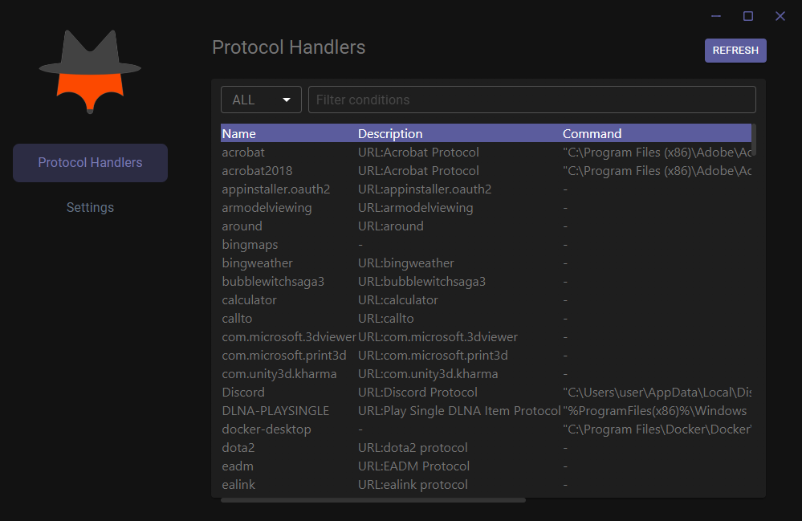

<h1 align="center">
  
</h1>

<div align="center">


</div>

<h3 align="center">
  URLProtocolView
</h3>

URLProtocolView is a simple Windows utility application that displays all URL protocols that are currently installed on your system. For each URL protocol, the following information is displayed: The protocol name, the protocol description and the command-line that is executed when you type or click the URL.

This project was deeply inspired by [URLProtocolView](https://www.nirsoft.net/utils/url_protocol_view.html) and [Clash Verge](https://github.com/zzzgydi/clash-verge). This application it's a light-fork of Clash Verge.

<div align="center">
  
</div>

### 📖 Prerequisites

- [Rust](https://www.rust-lang.org/tools/install)

- [Node.js](https://nodejs.org/en/download/)

- [Microsoft C++ Build Tools](https://visualstudio.microsoft.com/visual-cpp-build-tools/)
### 🖥️ Development

```shell
npm install
```

Then run

```shell
npm run dev
```
